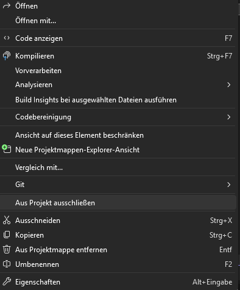
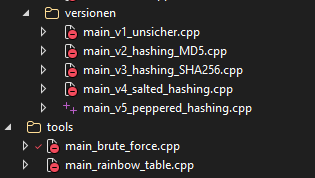

# Facharbeit_Kryptologie_cpp

Hier ist mein Quellcode passend zu meiner Facharbeit. 
Es ist ein login system (Konsolenanwendung) mit Fokus auf Passwortsicherheit.

Ich habe das ganze bewusst in mehrere Versionen unterteilt, um zu zeigen, wie sich die Sicherheitslücken schrittweise verbessern.

---

## Version 1:
[main_v1_unsicher.cpp](src/versionen/main_v1_unsicher.cpp)

- Passwörter sind in Klartext gespeichert
- einfaches Konsolenmenü
- keinerlei kryptographischen Verfahren
- dient als Grundlage für die anderen Versionen

## Version 2:
[main_v2_hashing_MD5.cpp](src/versionen/main_v2_hashing_MD5.cpp)

- Passwörter werden durch MD5 gehasht
- Passwörter dadurch nicht mehr im Klartext gespeichert

## Version 3:
[main_v3_hashing_SHA256.cpp](src/versionen/main_v3_hashing_SHA256.cpp)

- umstellung auf moderneres kryptographisches Verfahren (SHA-256)
- erhöhte Sicherheit gegenüber MD5

## Version 4:
[main_v4_salted_hashing.cpp](src/versionen/main_v4_salted_hashing.cpp)

- Einführung von Salt
- Wiederstandsfähiger gegenüber Rainbow Tables
- gleiche Passwörter erhalten unterschiedliche Hashwerte
- Einführung vom entfernen sensible Daten aus dem ram

## Version 5:
[main_v5_pepper.cpp](src/versionen/main_v5_peppered_hashing.cpp) | [AuthManager.h](src/versionen/AuthManager-v5.h)

- einführung von einem nicht veränderbaren Peppers
- Erschwert Angriffe

## Version 6:
[main_v6_2fa.cpp](src/versionen/main_v6_2fa.cpp) | [AuthManager.h](src/versionen/AuthManager.h)

- Implementierung von 2fa (6 stelliger Sicherheitscode)


---
# Hacker Tools:

- im ordner tools befinden sich beispiele für einfache hacker tools die zeigen wie unsicher die versionen 1-4 sind

## Rainbow Table:
[main_rainbow_table.cpp](tools/main_rainbow_table.cpp)

- läuft mithilfe einer API 
- Hashes werden mit dem des Programms verglichen und ausgewertet
- zeigt wie schnell Passwörter mit Rainbow Tables geknackt werden können

## Brute Force:
[main_brute_force.cpp](tools/main_brute_force.cpp)

- generiert alle möglichen Kombinationen von Passwörtern

---
# Hinweis:

- Projekt funktioniert nur auf Windows durch die Windows API aber man kann dies mit anderen librarys umgehen
- ersatz für windows die API wären librarys wie chrono oder ctime
- Compiler muss mindestens auf c++ 17 sein um es nutzen zu können
- WICHTIG: alle only header files müssen im include ordner liegen (generell nicht vom Projekt entfernt werden)!
- im ordner data befindet sich ein weiterer ordner namens list dort braucht man eine txt datei die man online runterladen kann rockyou.txt heißt die. Das ist eine Passwort liste mit über Millionen von Passwörtern die von Hackern oft verwendet wird. (diese bitte hinzufügen!)

- Da das Programm in c++ geschrieben ist darf man nur eine einzige main Datein bzw Funktion haben. D.h. alle versionen müssen aus dem Projekt ausgeschlossen werden (siehe Bild 1). Am ende soll es so wie in Bild 2 aussehen wenn man Visual Studio nutzt. Alle versionen außer die gewünschte müssen ausgeschlossen werden





---

## Repo klonen:

```bash
git clone [https://github.com/dev-dawud/Facharbeit_Kryptologie_cpp](https://github.com/dev-dawud/Facharbeit_Kryptologie_cpp)
