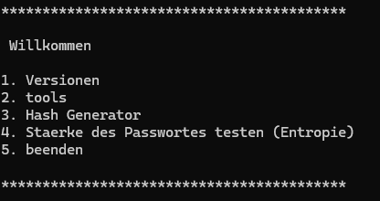
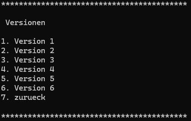
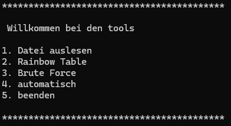
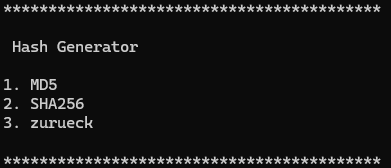

# Facharbeit_Kryptologie_cpp

> **Sind die Hashing Algorithmen MD5 und SHA-256 ihrem Alter gerecht ?**

Facharbeit_Kryptologie_cpp ist ein in C++ geschriebenes Programm, das im Rahmen meiner Facharbeit entwickelt wurde.
Es veranschaulicht, wie sich die Sicherheitsstandards bei der Passwortspeicherung über die Jahre entwickelt haben. 
Das Projekt enthält ein iterativ aufgebautes Authentifizierungssystem sowie verschiedene forensische Tools (Brute-Force, Rainbow-Tables), um diese Sicherheitsstandards einem praktischen Stresstest zu zeigen.




---

## Voraussetzungen
- Compiler version muss mind. die version **C++ 17** (oder neuer) sein
- Das Projekt nutzt die `<windows.h>` Header Datei und ist somit nur für Windows optimiert. 
Für Linux/MacOS müssen Bibliotheken wie `<chrono>` oder `<ctime>` als Ersatz implementiert und der Code leicht angepasst werden.

## Installation

Nutze ``git clone`` um das Projekt im beliebigen Projektverzeichnis zu klonen oder lade das Projekt direkt über Github herunter.

```bash
git clone https://github.com/dev-dawud/Facharbeit_Kryptologie_cpp.git
```

Nachdem das Projekt heruntergeladen wurde, ist es wichtig, die ``rockyou.txt`` aus folgendem [Repository](https://github.com/brannondorsey/naive-hashcat/releases/download/data/rockyou.txt) von Github herunter zu laden und entpacken.
WICHTIG: die datei muss in den Ordner ``data/list`` liegen bzw. verschoben werden:
1. ```bash
   cd Facharbeit_Kryptologie_cpp/data/list
   ```

### Compilereinstellungen & Sicherheitshinweise
1. Bevor das Programm ausgeführt wird, wäre es ratsam in der IDE unbedingt vom **Debug**-Modus in den **Release (x64)**-Modus zu wechseln. 
Nur so erhältt man die volle Performance, die besonders für die Brute-Force Algorithmen entscheidend ist.
2. Da das Programm auffällige Algorithmen wie Brute-Force simuliert, kann es vorkommen, dass der Windows Defender oder andere Antivirenprogramme fälschlicherweise anschlagen.
Es wird empfohlen, den Projektordner vor dem Kompilieren auf die Whitelist zu setzen.

## Nutzung
Im folgenden wird ein Beispiel Programm ausgeführt: 

1. Über Option 4 die Stärke des gewünschten Passworts messen
2. Über Option 3 einen Hash des Passworts erzeugen (MD5 oder SHA-256, mit ode ohne Salt)
3. Den Hash kopieren und über Option 2 mit den Hacker-Tools testen
4. Über Option 1 die verschiedenen Login versionen ausprobieren, testen und vergleichen
   
---

# Projektumfang & Features

## Versionen des Login-Systems



### Version 1 – Klartext (unsicher)
[main_v1_unsicher.h](include/src/versionen/main_v1_unsicher.h)

- Passwörter sind in Klartext gespeichert
- einfaches Konsolenmenü
- keinerlei kryptographischen Verfahren
- dient als Grundlage für die anderen Versionen

### Version 2 – MD5 Hashing
[main_v2_hashing_MD5.h](include/src/versionen/main_v2_hashing_MD5.h)

- Passwörter werden durch MD5 gehasht
- Passwörter dadurch nicht mehr im Klartext gespeichert

### Version 3 – SHA-256 Hashing
[main_v3_hashing_SHA256.h](include/src/versionen/main_v3_hashing_SHA256.h)

- umstellung auf moderneres kryptographisches Verfahren (SHA-256)
- erhöhte Sicherheit gegenüber MD5

### Version 4 – Salting
[main_v4_salted_hashing.h](include/src/versionen/main_v4_salted_hashing.h)

- Einführung von Salt
- Wiederstandsfähiger gegenüber Rainbow Tables
- gleiche Passwörter erhalten unterschiedliche Hashwerte
- Einführung vom entfernen sensible Daten aus dem ram

### Version 5 – Peppering
[main_v5_peppered_hashing.h](include/src/versionen/main_v5_peppered_hashing.h) | [AuthManager-v5.h](include/src/versionen/backend/AuthManager-v5.h)

- einführung von einem nicht veränderbaren Peppers
- Erschwert Angriffe

### Version 6 – Zwei Faktor Authentifizierung
[main_v6_2fa.h](include/src/versionen/main_v6_2fa.h) | [AuthManager.h](include/src/versionen/backend/AuthManager.h)

- Implementierung von 2fa (6 stelliger Sicherheitscode)

---

## Forensische Tools (Hacker-Tools)

Die Tools zeigen verschiedene Angriffsmethoden und zeigen, wie unsicher die früheren Versionen sind.



### Datei auslesen
- liest die gespeicherten Nutzerdaten jeder Version aus
- zeigt den Unterschied zwischen Klartext und Hash

### Rainbow-Table
[main_rainbow_table.h](include/src/tools/main_rainbow_table.h)

- nutzt die `rockyou.txt` Passwortliste zum Abgleich
- zusätzlich wird eine externe API für die Suche verwendet
- zeigt, wie schnell Passwörter ohne Salt geknackt werden können

### Brute-Force
[main_brute_force.h](include/src/tools/main_brute_force.h)

- generiert systematisch alle möglichen Zeichenkombinationen
- erkennt automatische den hashtyp anhand der Hash Länge
- Zeitmessung für die Dauer des Angriffs
- Funktioniert für Passwörter bis 7 Zeichen (ab 6 Zeichen sehr langsam)

### Automatischer Angriff
[main_hack.h](include/src/tools/main_hack.h)

- Kombiniert Rainbow Table und Brute Force
- erkennt automatisch, ob es sich um einen MD5- oder SHA-256-Hash handelt
- versucht zuerst die Passwortliste, dann die API, und als letzte Option Brute Force

---

## Zusätzliche Module

### Hash Generator

 

[hashGenerator.h](include/src/hashGenerator.h)

- erzeugt MD5- oder SHA-256 Hashes
- Optional mit Salt für erhöhte Sicherheit
- Generierte Hashes können direkt mit den Hacker Tools getestet werden

### Passwortstärke tester (Entropie)
[entropy.h](include/src/entropy.h)

- Berechnet die Passwortstärke mit der Shannon-Entropie: `H = n × log₂(s)`

Tabelle der möglichen Ergebnisse:

| Entropie (Bits) | Bewertung |
|:---:|:---:|
| < 24     | Sehr schwach |
| 24 – 49  | Schwach      |
| 50 – 74  | Akzeptabel   |
| 75 – 100 | Stark        |
| ≥ 100    | Sehr stark   |

---

## Contributing
Dies ist ein Schulprojekt für meine Facharbeit, daher ist das Projekt grundsätzlich abgeschlossen. 
Konstruktives Feedback oder Vorschläge zur Codeoptimierung sind dennoch jederzeit willkommen.
Eröffne dafür einfach ein Issue oder erstelle einen Pull Request.

## Verwendete Bibliotheken

- [picosha2](https://github.com/okdshin/PicoSHA2) – Header only SHA-256 Implementierung
- [md5.h/md5.cpp](http://www.zedwood.com/article/cpp-md5-function) – Header only MD5 Implementierung
- [rockyou.txt](https://github.com/brannondorsey/naive-hashcat/releases/download/data/rockyou.txt) – Passwortliste
- weitere Quellen die für das Projekt verwendet wurden, finden Sie in der Datei [RESSOURCES.md](RESSOURCES.md)

---

## Lizenz

Dieses Projekt steht unter der MIT Lizenz - weitere Informationen finden Sie in der Datei [LICENSE](LICENSE).
